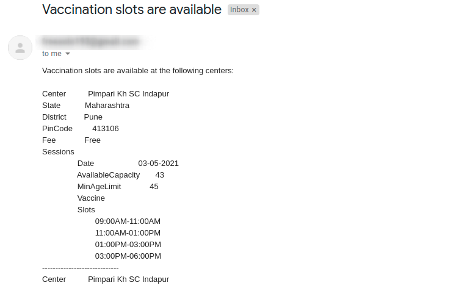

# covaccine-notifier

CoWIN Portal Vaccine availability notifier

covaccine-notifier periodically checks and sends email notifications for available slots for the next 7 days on CoWIN portal in a given area and age.

**Sample screenshot**



## Installation

### Install the pre-compiled binary

```
./install.sh | sh

On Your Mac:
brew install portaudio
brew install mpg123

In your bash_profile
export C_INCLUDE_PATH="/usr/local/homebrew/include"
export LIBRARY_PATH="/usr/local/homebrew/lib"

go build && go install && mv ./bin/bin/covaccine-notifier ./covaccine-notifier
./covaccine-notifier --state Maharashtra --district Nagpur --age 41 -e email@gmail.com -p app_pwd -n notify.mp3 -w 91mobile -b 561793 -i 120


```

## Usage

covaccine-notifier can monitor vaccine availability either by pin-code or state and district names. It can also send you whatsapp texts, email, receive OTP via whatsapp text and book and appointment if CAPTCHA is sent via whatsapp text.

```bash
$ ./covaccine-notifier --help
CoWIN Vaccine availability notifier India

Usage:
  covaccine-notifier [FLAGS] [flags]

Flags:
  -a, --age int                    Search appointment for age
  -b, --bookingCenterId int        Preferred booking center Id
  -d, --district string            Search by district name
  -e, --email string               Email address to send notifications
  -h, --help                       help for covaccine-notifier
  -i, --interval int               Interval to repeat the search. Default: (240) second
  -n, --notificationFile string    Specify a local MP3 file to play when a slot is available
  -p, --password string            Email ID password for auth
  -c, --pincode string             Search by pin code
  -s, --state string               Search by state name
  -w, --whatsAppRemoteNum string   Specify a remote WhatsApp mobile number

```

**Note:** Gmail password won't work for 2FA enabled accounts. Follow [this](https://support.google.com/accounts/answer/185833?p=InvalidSecondFactor&visit_id=637554658548216477-2576856839&rd=1) guide to generate app token password and use it with `--password` arg 

## Examples

### Terminal

#### Search by State and District

```
covaccine-notifier --state Maharashtra --district Akola --age 27  --email <email-id> --password <email-password>
```

#### Search by Pin Code

```
covaccine-notifier --pincode 444002 --age 27  --email <email-id> --password <email-password>
```

#### Search in a district and send whatsapp and email notifications
```
./covaccine-notifier --state Maharashtra --district Mumbai --age 45 -e email@gmail.com -p abcdefghijkl -n notify.mp3 -w 91<mobilenumber> -b <Preferred center ID>
```
You can get the center ID from the whatsapp text notification

## Contributing

We love your input! We want to make contributing to this project as easy and transparent as possible, whether it's:
- Reporting a bug
- Discussing the current state of the code
- Submitting a fix
- Proposing new features

## Acknowledgement
The initial base code for searching the availability is based on https://github.com/PrasadG193/covaccine-notifier
All additions like whatsapp, sound nitifications, OTPs, Captcha, and other API handling for beneficiaries, appointments etc has been added.
